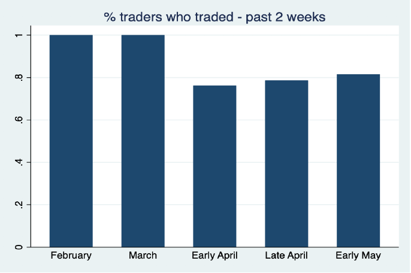
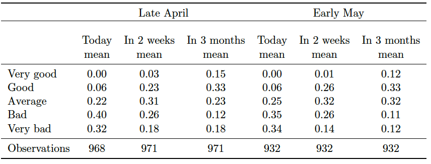
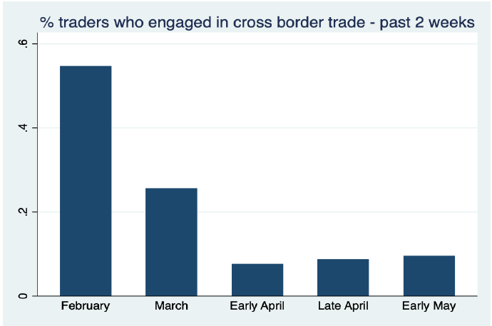

  
    
  
These data comes from surveys conducted with domestic and cross border traders through the Trader Border Project that focus on traders in markets located within 40 kms distance to the Kenya-Uganda border. The markets are in Busia, Bungoma and Kakamega (Kenya). Traders have been surveyed since February 2020 and are currently being surveyed every two
weeks through phone surveys. The representative sample includes 1,160 small and medium scale traders, both domestic and cross-border traders. Cross border traders use both the official Busia or Malaba border crossings and/or informal border crossings. 79% of the traders trade in agriculture products, 21 % in shoes and clothing. The sample includes 80%
women traders.   
  
  
These data is collected through Innovations for Poverty Action and is led by Principal Investigator Eleanor Wiseman (U.C. Berkeley). Please contact [ewiseman@berkeley.edu](mailto:ewiseman@berkeley.edu) with any questions.

##  {.tabset}

### Trading activity  
**Trading activity: did you trade - past 2 weeks**
  
  
  
### Business wellbeing
**Expectation of business wellbeing**
  
  
  
### Border crossing
**Border crossing: did you trade cross border - past 2 weeks**
  
  
  
### Issues
**Issues while crossing the border - past 2 weeks**
  
  
  
  
### Corruption and harassment
**Corruption and harassment while crossing the border - compared to past 2 weeks**
  
  
   
  
