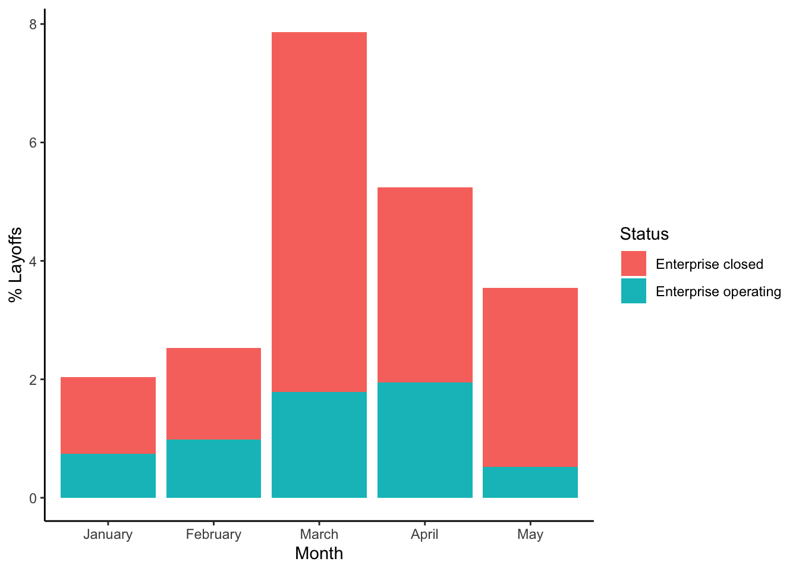

  
##  {.tabset}

### Operations

**Percentage of enterprises operating each week** 

preservef5f2e6dfa05d5147

*** 

**Status by month relative to February's operation levels** 

*** 
### Revenue and profit  
**Enterprises revenue and profits in the past 14 days**
preserve10319463f5991f20

*** 
**Revenue by sector in the past 14 days (2 week average)**
preserve127f36b60d3c211c

\*Agriculture is normalized by last year's 2-week revenue, while all other variables are normalized by the average reported revenue for February. Reported amounts were averaged every two weeks. 

*** 

### Investment and wages

**Investment (USD, PPP) - past 14 days**
preserveb312f13159938176
  
  ***  
  
  
**Wages (USD, PPP) - past 14 days**
preserve1766521759381264

  
***     

### COVID-19  
**COVID-19 Impact**

How has COVID-19 affected this business?*  

preserve3eb0b8344ad41b70
    
*This is for the proportion of enterprises currently operating.  

  ***  
### Layoffs

**Temporal distribution of layoffs relative to February's employment level**

*** 

## {}
      
These data comes from phone survey interviews conducted by [REMIT Kenya](http://remitkenya.co.ke/) in Siaya County, Kenya. We are collecting data for a sample of ~5,000 enterprises in the county, which is representative of the whole population of enterprises. At the same time, our weekly sampling method assures weekly representativeness of the overall sample.

So far we have interviewed 3,041 enterprises, with the following distribution per week:

| Week	| Dates	| Number of surveys |
|------|:-----:|:---------:|
| Week 1 |	10 May 2020 - 16 May 2020	| 532 |
| Week 2 |	17 May 2020 - 23 May 2020	| 458 |
| Week 3 |	24 May 2020 - 30 May 2020	| 434 |
| Week 4 |	31 May 2020 - 06 June 2020	| 732 |
| Week 5 |	07 May 2020 - 13 June 2020	| 885 |

