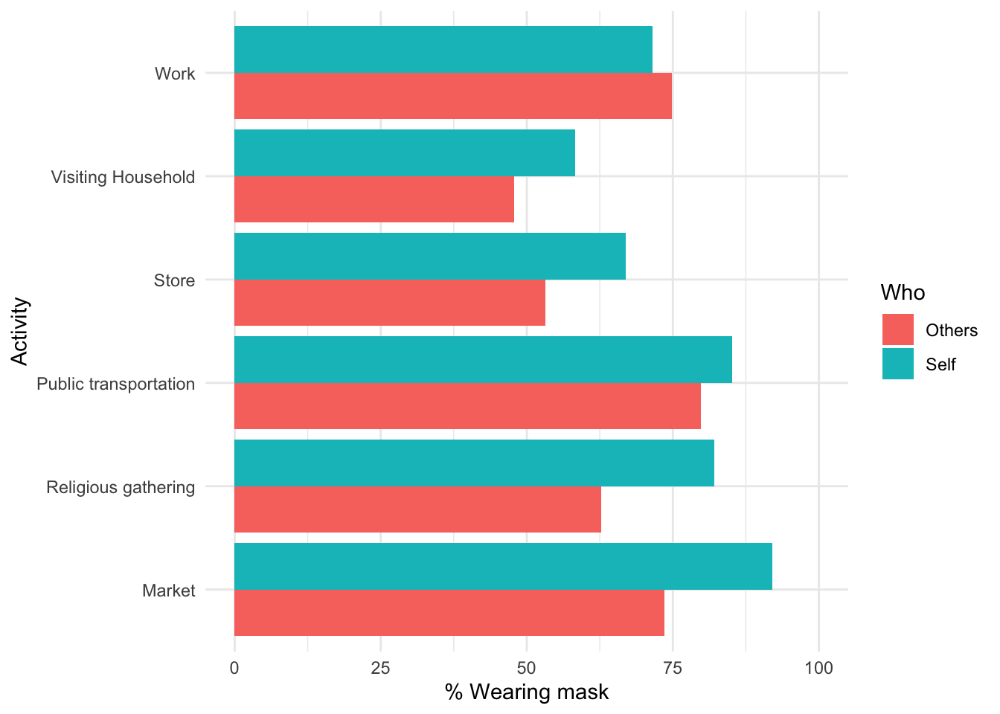
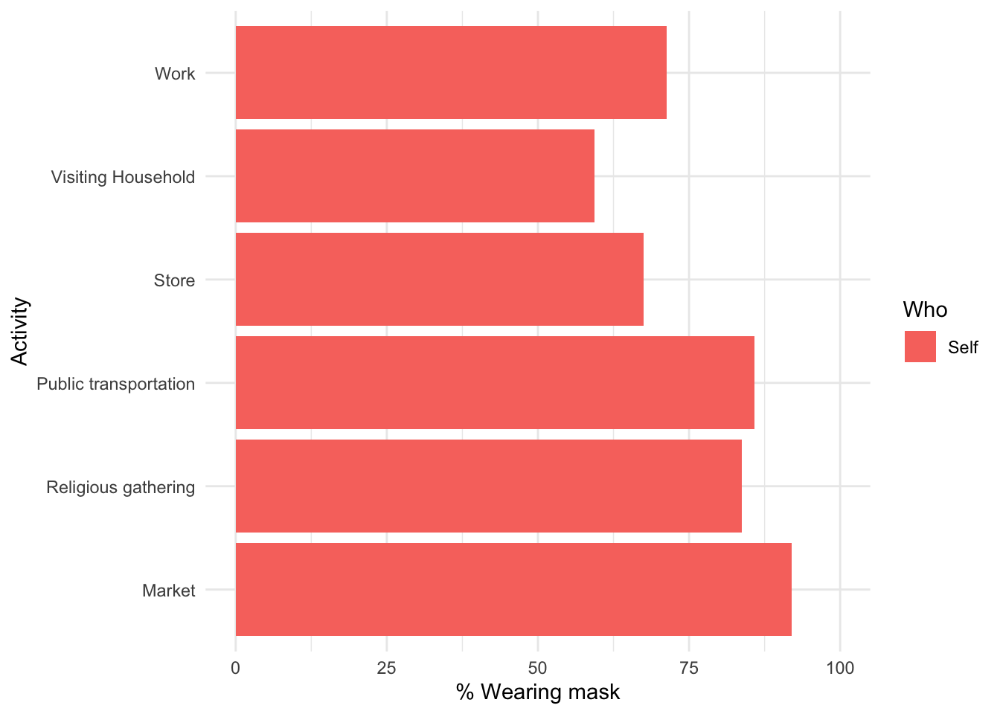
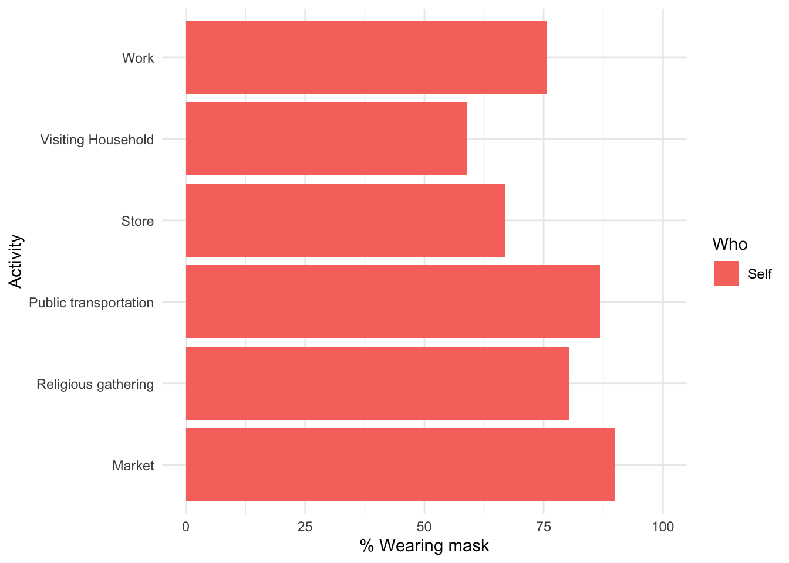

  
##  {.tabset}

### Income  
**Earnings per capita (USD, PPP) - past 14 days**

Households are assigned the high asset category if they reported higher asset holdings than the median household in a 2014-2015 baseline survey. Asset holdings data is only available for the 2014-2015 survey sample, which is a subsample of the current panel of households.  

####  {.tabset .tabset-pills}

##### All
preserve9e226719aba78ae6
  

  This plot aggregates income from each of the three earning sources, across all working-age household members, stacking them to add to the average earning per capita, including children, in the past 14 days. If the household does not perceive income from one or more of the sources, those data points are assigned zeros to assure representativeness for the whole population. 
  
##### High assets
preserve2d36e0d889e0cdde
  

  This plot aggregates income from each of the three earning sources, across all working-age household members, stacking them to add to the average earning per capita, including children, in the past 14 days. If the household does not perceive income from one or more of the sources, those data points are assigned zeros to assure representativeness for the whole population. 

##### Low assets 
preserve6dc5378ef967e51c
  

  This plot aggregates income from each of the three earning sources, across all working-age household members, stacking them to add to the average earning per capita, including children, in the past 14 days. If the household does not perceive income from one or more of the sources, those data points are assigned zeros to assure representativeness for the whole population.
  
##### Household with children 
preserve2fcb5aa96da5818f
  

  This plot aggregates income from each of the three earning sources, across all working-age household members, stacking them to add to the average earning per capita, including children, in the past 14 days. If the household does not perceive income from one or more of the sources, those data points are assigned zeros to assure representativeness for the whole population.
  
##### No children
preservece8c8a024c348134
  

  This plot aggregates income from each of the three earning sources, across all working-age household members, stacking them to add to the average earning per capita, including children, in the past 14 days. If the household does not perceive income from one or more of the sources, those data points are assigned zeros to assure representativeness for the whole population.
  
####  {}

***  

**Hourly Wages**

#### {.tabset .tabset-pills}

##### All

Hourly wages calculated by dividing total wages by total hours worked at the individual level, conditional on employment. Averages weighted by total hours worked at the individual level multiplied by household level weights. 

preserved46cbafd35505f04

##### High assets

Hourly wages calculated by dividing total wages by total hours worked at the individual level, conditional on employment. Averages weighted by total hours worked at the individual level multiplied by household level weights. 

preserve34ce8491f2fb8a3f

##### Low assets

Hourly wages calculated by dividing total wages by total hours worked at the individual level, conditional on employment. Averages weighted by total hours worked at the individual level multiplied by household level weights. 

preserveddc1797f0b282bf2

#### {}

***  
  
**Dissaving per capita (USD, PPP) - past 14 days**  
 The dissaving variable is constructed by adding the value of assets sold and loans taken, and substracting the value of any assets or durables bought.  
 
####  {.tabset .tabset-pills}

##### All

preserve4c50edd5e40f5bc8

##### High assets

preservee2650a182f1c8384

##### Low assets

preserveefefcb48291531ef

##### Household with children

preserveaff59f4b1b763476

##### No children

preservecd51de2a79da6596

#### {}

***  
   
  **Percentage of households receiving support - past 14 days**  

####  {.tabset .tabset-pills}

##### All

We ask whether in the past 14 days anyone in the household received a gift/assistance of money or goods, and its value, from (i) the government, (ii) from a non-governmental organization or community group, or (iii) from an individual politician or government official.  

preserve468821a24bc2bb8b
  
##### High assets

We ask whether in the past 14 days anyone in the household received a gift/assistance of money or goods, and its value, from (i) the government, (ii) from a non-governmental organization or community group, or (iii) from an individual politician or government official.  

preservec66e485af729683d

##### Low assets

We ask whether in the past 14 days anyone in the household received a gift/assistance of money or goods, and its value, from (i) the government, (ii) from a non-governmental organization or community group, or (iii) from an individual politician or government official.  

preserve7ce743f90ba46885

##### Household with children

We ask whether in the past 14 days anyone in the household received a gift/assistance of money or goods, and its value, from (i) the government, (ii) from a non-governmental organization or community group, or (iii) from an individual politician or government official.  

preserve2b3d3317fcb42e1a

##### No children

We ask whether in the past 14 days anyone in the household received a gift/assistance of money or goods, and its value, from (i) the government, (ii) from a non-governmental organization or community group, or (iii) from an individual politician or government official.  

preserve1980ef12113edc62

#### {}

*** 

### Consumption

**Weekly consumption per capita (USD, PPP)**

Households are assigned the high asset category if they reported higher asset holdings than the median household in a 2014-2015 baseline survey. Asset holdings data is only available for the 2014-2015 survey sample, which is a subsample of the current panel of households.  

####  {.tabset .tabset-pills}

##### All

preservedd3132880710c43e
Own-food consumption accounts for own agricultural and pastoral production at market value. Pre-covid average uses 2016-2017 data.

##### High assets

preserveed24e7f3e9079ade
Own-food consumption accounts for own agricultural and pastoral production at market value. Pre-covid average uses 2016-2017 data.

##### Low assets

preserved8687ddcf13d737d
Own-food consumption accounts for own agricultural and pastoral production at market value. Pre-covid average uses 2016-2017 data.

##### Household with children

preserveab44438c0a8e7b4e
Own-food consumption accounts for own agricultural and pastoral production at market value. Pre-covid average uses 2016-2017 data.

##### No children

preserve63f675be2e547a83
Own-food consumption accounts for own agricultural and pastoral production at market value. Pre-covid average uses 2016-2017 data.

#### {}

*** 

### Food Security  
**Number of days skipping meals in the past 7 days**  

Households are assigned the high asset category if they reported higher asset holdings than the median household in a 2014-2015 baseline survey. Asset holdings data is only available for the 2014-2015 survey sample, which is a subsample of the current panel of households.  

####  {.tabset .tabset-pills}

##### All

preserve011040a678ba23d4
Pre-COVID average uses data from 2016-2017.

##### High assets

preservedcee30440dde0881
Pre-COVID average uses data from 2016-2017.

##### Low assets

preservef8fd472b7160e9bc
Pre-COVID average uses data from 2016-2017.

##### Household with children

preservebe7bcf13b7de2d3b
Pre-COVID average uses data from 2016-2017.

##### No children

preservec4502ebc18920916
Pre-COVID average uses data from 2016-2017.

#### {}
     
***  
  
**Percentage of sample unable to buy usual amount of food due to:**  

####  {.tabset .tabset-pills}

##### All

 We ask whether in the past 7 days, any household member was unable to buy the amount of food they usually buy because of: (i) price of food being too high, (ii) household income having dropped, and (iii) shortages in markets.  
   
 
   
preservead99e77d168c165a

##### High assets

 We ask whether in the past 7 days, any household member was unable to buy the amount of food they usually buy because of: (i) price of food being too high, (ii) household income having dropped, and (iii) shortages in markets.  
   
 
   
preservec73bfd4a88672c96

##### Low assets

 We ask whether in the past 7 days, any household member was unable to buy the amount of food they usually buy because of: (i) price of food being too high, (ii) household income having dropped, and (iii) shortages in markets.  
   
 
   
preserveff64507ac7404c04

#### {}
     
***  
   
   **Other food hardship experiences, percentage of sample**

####  {.tabset .tabset-pills}

##### All

We ask whether in the past 7 days, any household member experienced: (i) having to reduce the number of meals and/or the portion of each meal they would usually eat, (ii) difficulties in going to food markets due to mobility restrictions imposed by government, and (iii) difficulties in buying food due to most food markets being closed.  
    
  
preserved93426df8bf68334

##### High assets

We ask whether in the past 7 days, any household member experienced: (i) having to reduce the number of meals and/or the portion of each meal they would usually eat, (ii) difficulties in going to food markets due to mobility restrictions imposed by government, and (iii) difficulties in buying food due to most food markets being closed.  
    
  
preservec9344ea3ae4608a5

##### Low assets

We ask whether in the past 7 days, any household member experienced: (i) having to reduce the number of meals and/or the portion of each meal they would usually eat, (ii) difficulties in going to food markets due to mobility restrictions imposed by government, and (iii) difficulties in buying food due to most food markets being closed.  
    
  
preservea72ca5360340bacd

#### {}
 
   
***  
### Household enterprises  
**Enterprises revenue and profits in the past 14 days**

Households are assigned the high asset category if they reported higher asset holdings than the median household in a 2014-2015 baseline survey. Asset holdings data is only available for the 2014-2015 survey sample, which is a subsample of the current panel of households. 

#### {.tabset .tabset-pills}

##### All

preserve3ad107fe43b3c0bb

##### High assets

preserve815f6387bc1291e5

##### Low assets

preserve56afe62dbb682f0f

#### {}
  
  ***  

### COVID-19  

**Reported COVID-19 Behavior Adoption** 

Households are assigned the high asset category if they reported higher asset holdings than the median household in a 2014-2015 baseline survey. Asset holdings data is only available for the 2014-2015 survey sample, which is a subsample of the current panel of households.  

####  {.tabset .tabset-pills}

##### All

We ask respondents whether they have changed their behavior in any way since learning about COVID-19, and if so, how  it has changed.

preservea3bb5b818226fccc

##### High assets

We ask respondents whether they have changed their behavior in any way since learning about COVID-19, and if so, how  it has changed.

preservea2e64bbc87b068e0

##### Low assets

We ask respondents whether they have changed their behavior in any way since learning about COVID-19, and if so, how  it has changed.

preserve08cadbcce6aee6c9

##### Female

We ask respondents whether they have changed their behavior in any way since learning about COVID-19, and if so, how  it has changed.

preserve1afdff777c1959da

##### Male

We ask respondents whether they have changed their behavior in any way since learning about COVID-19, and if so, how  it has changed.

preserve14c8f1e41e18fb81

#### {}
    
***  

**Reported COVID-19 Symptoms, past 14 days**  

####  {.tabset .tabset-pills}

##### All

We ask respondents whether they have experienced any illnesses or symptoms of a given list in the past 14 days.  

preserve02718b135063167c

##### High assets

We ask respondents whether they have experienced any illnesses or symptoms of a given list in the past 14 days.  

preserve1350f87af941fa64

##### Low assets

We ask respondents whether they have experienced any illnesses or symptoms of a given list in the past 14 days.  

preserve5ac483dcc54ab7c4

##### Female

We ask respondents whether they have experienced any illnesses or symptoms of a given list in the past 14 days.  

preserveb627926f0431c484

##### Male

We ask respondents whether they have experienced any illnesses or symptoms of a given list in the past 14 days.  

preserveee7bbbf40af1627d

#### {}

*** 

**Number of in-person interactions (other than HH members)**  

####  {.tabset .tabset-pills}

##### All

  We ask: "Taken together, how many people outside this household have you interacted with in-person?"   

preserve6e850c6c1ac3cc83

##### High assets

  We ask: "Taken together, how many people outside this household have you interacted with in-person?"   

preserveacbc75a640d7bc02

##### Low assets

  We ask: "Taken together, how many people outside this household have you interacted with in-person?"   

preserveeeeef0411a887bd1

##### Female

  We ask: "Taken together, how many people outside this household have you interacted with in-person?"   

preserve4ed0c3106a9504ce

##### Male

  We ask: "Taken together, how many people outside this household have you interacted with in-person?"   

preserve1cedb5ea745fb92e

#### {}

*** 
**Face mask usage by activity / location**

Conditional on visiting location / participating in the activity. We present two variables, the first one is self-reported mask usage and the second one is the observed proportion of other people using a face mask. 

####  {.tabset .tabset-pills}

##### All

##### High assets

##### Low assets

##### Male

##### Female

#### {}

*** 

**Visited or had visitors from another household, past 14 days**

#### {.tabset .tabset-pills}

##### All

preservec1e6d26f3d1ec794

##### High assets

preserve5947838e3cb2543c

##### Low assets

preserve84c5b5f6fe7ba2c5

##### Household with children

preserve7568dc87f8913768

##### No children

preservee0e81804281bb6b4

#### {}

*** 
  
### Labor Supply

**Weekly labor supply (hours per household adult)**

Households are assigned the high asset category if they reported higher asset holdings than the median household in a 2014-2015 baseline survey. Asset holdings data is only available for the 2014-2015 survey sample, which is a subsample of the current panel of households.  

####  {.tabset .tabset-pills}

##### All

preservecf0417fbb73ae547
  
  This plot aggregates hours worked on each of the three sources, across all working-age household members, stacking them to add to the average weekly labor supply per household adult. If the household does not work any hours on one or more of the labor categories, those data points are assigned zeros to assure representativeness of the whole population. 
  
##### High assets

preserveaca1b927a2a6aaf8
  
  This plot aggregates hours worked on each of the three sources, across all working-age household members, stacking them to add to the average weekly labor supply per household adult. If the household does not work any hours on one or more of the labor categories, those data points are assigned zeros to assure representativeness of the whole population. 
  
##### Low assets

preserve4c35aa09a912f626
  
  This plot aggregates hours worked on each of the three sources, across all working-age household members, stacking them to add to the average weekly labor supply per household adult. If the household does not work any hours on one or more of the labor categories, those data points are assigned zeros to assure representativeness of the whole population. 

##### Household with children

preserve6c1c0a50f6ba6c97
  
  This plot aggregates hours worked on each of the three sources, across all working-age household members, stacking them to add to the average weekly labor supply per household adult. If the household does not work any hours on one or more of the labor categories, those data points are assigned zeros to assure representativeness of the whole population. 
  
##### No children

preserve6765eb873c032c57
  
  This plot aggregates hours worked on each of the three sources, across all working-age household members, stacking them to add to the average weekly labor supply per household adult. If the household does not work any hours on one or more of the labor categories, those data points are assigned zeros to assure representativeness of the whole population. 
  
#### {}

***  
### Children Education  

**Children educational activities** 

Households are assigned the high asset category if they reported higher asset holdings than the median household in a 2014-2015 baseline survey. Asset holdings data is only available for the 2014-2015 survey sample, which is a subsample of the current panel of households.  

####  {.tabset .tabset-pills}

##### All

We ask what has each child been doing over the last 15 minutes, whether the child has done any learning-related activities in the past 24 hours, and if so, what kind of activity. From this question we also learn whether the child attended school.

preserve53a63e338f2d518c

##### High assets

We ask what has each child been doing over the last 15 minutes, whether the child has done any learning-related activities in the past 24 hours, and if so, what kind of activity. From this question we also learn whether the child attended school.

preserveb8b43e7a8d374cf9

##### Low assets

We ask what has each child been doing over the last 15 minutes, whether the child has done any learning-related activities in the past 24 hours, and if so, what kind of activity. From this question we also learn whether the child attended school.

preserve0735bfe6acedd5f0

#### {}  
   
***  
  
### Household Violence

**Gender violence**

Households are assigned the high asset category if they reported higher asset holdings than the median household in a 2014-2015 baseline survey. Asset holdings data is only available for the 2014-2015 survey sample, which is a subsample of the current panel of households.  

####  {.tabset .tabset-pills}

##### All

We ask married/cohabitant female respondents whether their husband/partner has (i) threaten to harm them or someone close to them, (ii) hit, slapped, kicked, or physically hurt them, and (iii) forced them to perform sexual acts.* 

preservee2d86e7fb73ee769
  *This plot shows data only for the share of female respondents that were surveyed by a female field officer, and are currently married or living with a partner. This sub-sample accounts for ~55% of all married/cohabitant females in the study sample, and ~36% of all females.  
  
##### High assets

We ask married/cohabitant female respondents whether their husband/partner has (i) threaten to harm them or someone close to them, (ii) hit, slapped, kicked, or physically hurt them, and (iii) forced them to perform sexual acts.* 

preserve2a61fb4fd4d59d2a
  *This plot shows data only for the share of female respondents that were surveyed by a female field officer, and are currently married or living with a partner. This sub-sample accounts for ~55% of all married/cohabitant females in the study sample, and ~36% of all females.  
  
##### Low assets

We ask married/cohabitant female respondents whether their husband/partner has (i) threaten to harm them or someone close to them, (ii) hit, slapped, kicked, or physically hurt them, and (iii) forced them to perform sexual acts.* 

preservea33e9f1830bac39c
  *This plot shows data only for the share of female respondents that were surveyed by a female field officer, and are currently married or living with a partner. This sub-sample accounts for ~55% of all married/cohabitant females in the study sample, and ~36% of all females.  
  
#### {}
     
***  
  
**Violence in the household**  

####  {.tabset .tabset-pills}

##### All

We ask: (i) Over the past 14 days, has there been a higher than usual amount of fights with members of your household?, and (ii) In the past 14 days, did you or your partner ever beat any of the children living in this household?  
preserve0ea92b8755d17c91

##### High assets

We ask: (i) Over the past 14 days, has there been a higher than usual amount of fights with members of your household?, and (ii) In the past 14 days, did you or your partner ever beat any of the children living in this household?  
preserve49db1df2423e8d23

##### Low assets

We ask: (i) Over the past 14 days, has there been a higher than usual amount of fights with members of your household?, and (ii) In the past 14 days, did you or your partner ever beat any of the children living in this household?  
preserve600ac63f8ab8db58

#### {}

***  

### Trust

**Trust in government**  

Households are assigned the high asset category if they reported higher asset holdings than the median household in a 2014-2015 baseline survey. Asset holdings data is only available for the 2014-2015 survey sample, which is a subsample of the current panel of households.  

####  {.tabset .tabset-pills}

##### All

How much do you trust your country’s government to take care of its citizens?  
preserve439f2d153e8128c0

##### High assets

How much do you trust your country’s government to take care of its citizens?  
preserve69efd7948271cb79

##### Low assets

How much do you trust your country’s government to take care of its citizens?  
preserve0d551d2369201c79

##### Female

How much do you trust your country’s government to take care of its citizens?  
preserved41c1035ffb9f3cd

##### Male

How much do you trust your country’s government to take care of its citizens?  
preserveb49c27c5d555a1db

#### {}
   
***   
  
  **Trust in other people**  

####  {.tabset .tabset-pills}

##### All

Generally speaking, would you say that most people can be trusted or that you need to be very careful in dealing with people?  
preserve29540163a1d02275

##### High assets

Generally speaking, would you say that most people can be trusted or that you need to be very careful in dealing with people?  
preservefcefbcc90babc4b6

##### Low assets

Generally speaking, would you say that most people can be trusted or that you need to be very careful in dealing with people?  
preserveb070b3f9e6305368

##### Female

Generally speaking, would you say that most people can be trusted or that you need to be very careful in dealing with people?  
preserve416811fda0062cc8

##### Male

Generally speaking, would you say that most people can be trusted or that you need to be very careful in dealing with people?  
preserve34592702aee01154

#### {}

*** 

### Mental health

**Depression, CES-D-10** 

Households are assigned the high asset category if they reported higher asset holdings than the median household in a 2014-2015 baseline survey. Asset holdings data is only available for the 2014-2015 survey sample, which is a subsample of the current panel of households.  

####  {.tabset .tabset-pills}

##### All

**The Centre for Epidemiological Studies Depression Scale** (CES-D-10) is a 10-item Likert scale questionnaire assessing depressive symptoms in the past week. It includes three items on depressed affect, five items on somatic symptoms, and two on positive affect. Options for each item range from “rarely or none of the time” (score of 0) to “all of the time” (score of 3). Scoring is reversed for positive affect statements. Total scores can range from 0 to 30. **Higher scores suggest greater severity of symptoms.**  

preservee096823a6175e345

Pre-COVID average computed with data from 2016-2017

##### High assets

**The Centre for Epidemiological Studies Depression Scale** (CES-D-10) is a 10-item Likert scale questionnaire assessing depressive symptoms in the past week. It includes three items on depressed affect, five items on somatic symptoms, and two on positive affect. Options for each item range from “rarely or none of the time” (score of 0) to “all of the time” (score of 3). Scoring is reversed for positive affect statements. Total scores can range from 0 to 30. **Higher scores suggest greater severity of symptoms.**  

preserve959d2721ceda0f0f

Pre-COVID average computed with data from 2016-2017

##### Low assets

**The Centre for Epidemiological Studies Depression Scale** (CES-D-10) is a 10-item Likert scale questionnaire assessing depressive symptoms in the past week. It includes three items on depressed affect, five items on somatic symptoms, and two on positive affect. Options for each item range from “rarely or none of the time” (score of 0) to “all of the time” (score of 3). Scoring is reversed for positive affect statements. Total scores can range from 0 to 30. **Higher scores suggest greater severity of symptoms.**  

preserve4f903b2bb2cd359e

Pre-COVID average computed with data from 2016-2017

##### Female

**The Centre for Epidemiological Studies Depression Scale** (CES-D-10) is a 10-item Likert scale questionnaire assessing depressive symptoms in the past week. It includes three items on depressed affect, five items on somatic symptoms, and two on positive affect. Options for each item range from “rarely or none of the time” (score of 0) to “all of the time” (score of 3). Scoring is reversed for positive affect statements. Total scores can range from 0 to 30. **Higher scores suggest greater severity of symptoms.**  

preservee274522fba8e4636

Pre-COVID average computed with data from 2016-2017

##### Male

**The Centre for Epidemiological Studies Depression Scale** (CES-D-10) is a 10-item Likert scale questionnaire assessing depressive symptoms in the past week. It includes three items on depressed affect, five items on somatic symptoms, and two on positive affect. Options for each item range from “rarely or none of the time” (score of 0) to “all of the time” (score of 3). Scoring is reversed for positive affect statements. Total scores can range from 0 to 30. **Higher scores suggest greater severity of symptoms.**  

preserve609910876e5c7044

Pre-COVID average computed with data from 2016-2017

##### Household with children

**The Centre for Epidemiological Studies Depression Scale** (CES-D-10) is a 10-item Likert scale questionnaire assessing depressive symptoms in the past week. It includes three items on depressed affect, five items on somatic symptoms, and two on positive affect. Options for each item range from “rarely or none of the time” (score of 0) to “all of the time” (score of 3). Scoring is reversed for positive affect statements. Total scores can range from 0 to 30. **Higher scores suggest greater severity of symptoms.**  

preserveb21063f08e06070a

Pre-COVID average computed with data from 2016-2017

##### No children

**The Centre for Epidemiological Studies Depression Scale** (CES-D-10) is a 10-item Likert scale questionnaire assessing depressive symptoms in the past week. It includes three items on depressed affect, five items on somatic symptoms, and two on positive affect. Options for each item range from “rarely or none of the time” (score of 0) to “all of the time” (score of 3). Scoring is reversed for positive affect statements. Total scores can range from 0 to 30. **Higher scores suggest greater severity of symptoms.**  

preserve32656764b03073d3

Pre-COVID average computed with data from 2016-2017

#### {}

***  

We also ask questions 1-5 on core mental health from the John Hopkins Bloomberg School of Public Health (JHSPH) [resource](https://www.elizabethstuart.org/files/MH_survey-items-request_03_20.pdf).  

**Nervious, anxious or on edge**  

In the past 7 days, how often have you felt nervous, anxious, or on edge?  
preservee9c5249646eb9e6e
   
*** 
**Depressed**    

In the past 7 days, how often have you felt depressed?  

preserve1a52c2ea992f1381
   
*** 
**Lonely**    

In the past 7 days, how often have you felt lonely?  

preservef41323dc3de356d3
   
*** 
**Hopeful about the future**  
    
In the past 7 days, how often have you felt hopeful about the future?  

preserve2a4d4fb619620476
   
*** 
**Had physical reactions due to COVID-19**  

  In the past 7 days, how often have you had physical reactions, such as sweating, trouble breathing, nausea, or a pounding heart, when thinking about your experience (e.g., social distancing, loss of income/work, concerns about infection) with the coronavirus/COVID-19 pandemic? 
  
preservec4a407b49f7be268
   
*** 

### Food prices

**Animal Products**  
preservefe6ddec6dd6a66d4
  
***     

**Fruits / Vegetables**  
preservebb243c2cf3ebcfaa
  
***       

**Grains / Other**  
preserve342421ce2de5e493
  
***    

### Other prices

**Services**  
preservedbebc6395155dabc
  
***  

**Livestock**  
preservefc4dcc629de6ce24
  
  ***   
    

**Non-food**  
preserve0840aa14cf4226d4
  
***     

## {}

Households are assigned the high asset category if they reported higher asset holdings than the median household in a 2014-2015 baseline survey. Asset holdings data is only available for the 2014-2015 survey sample, which is a subsample of the current panel of households. 

Eligible households are those that qualified for [GiveDirectly transfers](http://emiguel.econ.berkeley.edu/assets/miguel_research/88/GE-Paper_2019-12-18.pdf) by living in homes with thatched roofs in 2014. 
      
These data comes from phone survey interviews conducted by [REMIT Kenya](http://remitkenya.co.ke/) in Siaya County, Kenya. We are collecting data for a sample of ~11,000 households in the county, which is representative of the whole population. At the same time, our weekly sampling method assures weekly representativeness of the overall sample.

So far we have interviewed 8,582 households, with the following distribution per week:

| Week	| Dates	| Number of surveys | Survey round |
|------|:-----:|:---------:|:-------:|
| Week 1 |	05 April 2020 - 11 April 2020	| 745 | 1 |
| Week 2 |	12 April 2020 - 18 April 2020	| 744 | 1|
| Week 3 |	19 April 2020 - 25 April 2020	| 1,478 |1|
| Week 4 |	26 April 2020 - 02 May 2020	| 1,146 |1|
| Week 5 |	03 May 2020 - 09 May 2020	| 1,499 |1|
| Week 6 |	10 May 2020 - 16 May 2020	| 986 |1|
| Week 7 |	17 May 2020 - 23 May 2020	| 1,217 |1|
| Week 8 |	24 May 2020 - 30 May 2020	| 771 |1|
| Week 12 |	21 June 2020 - 27 June 2020	| 1747 |2|
| Week 14 |	5 July 2020 - 11 July 2020	| 1087 |2|
| Week 15 |	12 July 2020 - 18 July 2020	| 611 |2|
| Week 16 |	19 July 2020 - 25 July 2020	| 889 |2|
| Week 17 |	26 July 2020 - 1 August 2020	| 820 |2|
| Week 18 |	2 August 2020 - 8 August 2020	| 870 |2|
| Week 19 |	9 August 2020 - 15 August 2020	| 835 |2|
| Week 20 |	16 August 2020 - 22 August 2020	| 886 |2|
| Week 21 |	23 August 2020 - 29 August 2020	| 848 |2|

