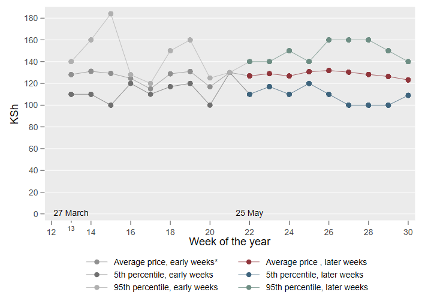
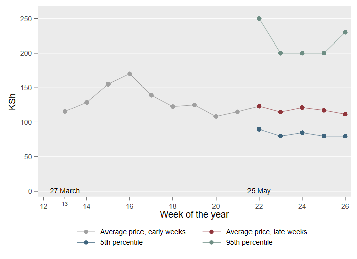
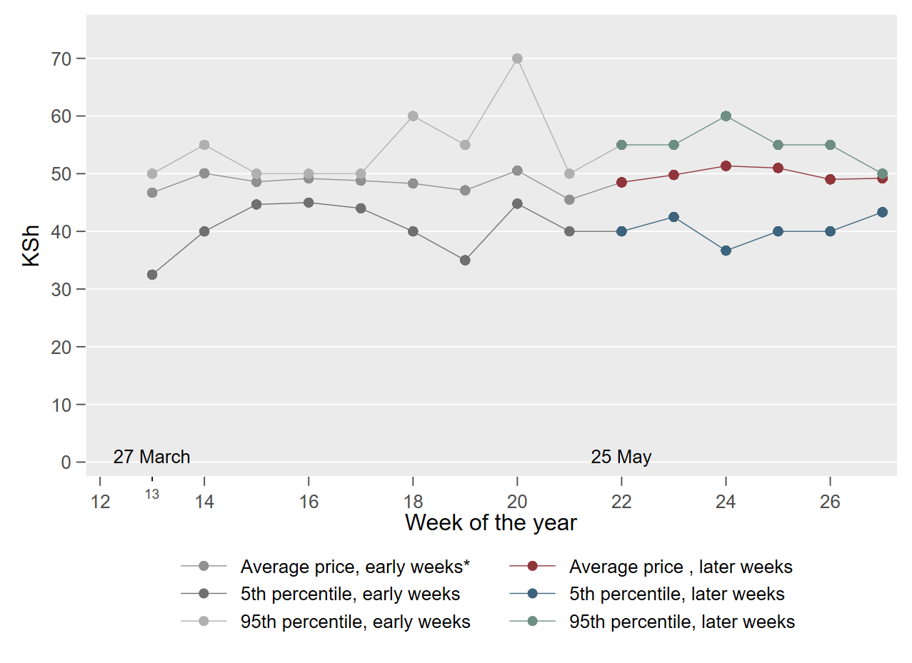
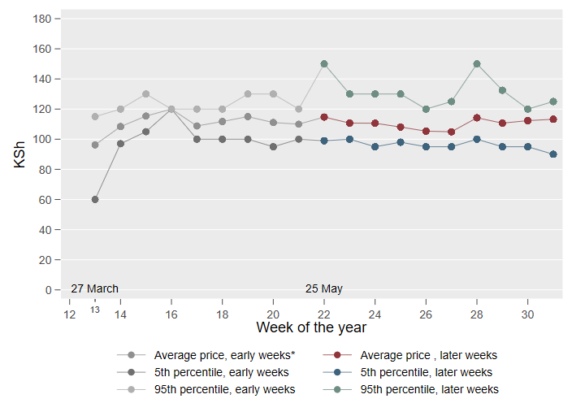
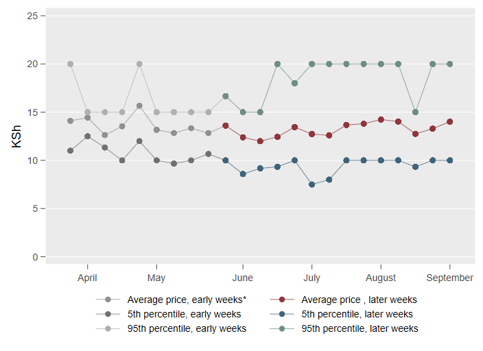

```{r setup, include=FALSE}
knitr::opts_chunk$set(echo = TRUE)
```
  
    
  


##  {.tabset}

### Bread and cereals 
<font size="5">**Maize flour (2 kg)**</font>
  
  

***   

<font size="5">**Rice (1 kg)**</font>
  
  
  
*** 

<font size="5">**White bread (400 g)**</font>
  
  

*** 

### Other items

<font size="5">**Sugar (1 kg)**</font>
  
  

***   

<font size="5">**Egg (one)**</font>
  
  

*** 

<font size="5">**Banana (one)**</font>
  
  

*** 

## {}

We rely on a quick-response online survey to track product prices and availability of selected essential consumer products across Kenya. The data are collected with the help of volunteers, mainly university students and affiliates of NGOs, who record information through an online form on their smartphone - either when or after visiting a shop in-person or getting deliveries. Embedding the survey into day-to-day activities of respondents helps us to address concerns about initiating or prolonging human interactions that would not occur otherwise. The geographic distribution of the survey responses correlates strongly with population density and covers 36 out of 47 counties. Regions of the country with good mobile network coverage are over-represented in our sample. Counties in the North of Kenya are under-represented. About 30% of the respondents shop at supermarkets, close to 40% at general shops, 15% at kibandas, 7% at roadside stalls, 6% at open air markets and the remaining 2% on online platforms. 

So far we collected 1380 survey responses since 27th March 2020.  On average respondents record prices of 4-5 items per survey. 

*The data is sparse in the early weeks of the data collection, which needs to be taken into account for the interpretation of the price dispersion in those week. With the support of numerous partners we were able to expand our network of volunteers over time.

| Week of the year	| Dates	| Number of online surveys |
|------|:-----:|:---------:|
| Week 13 |	27 March 2020 - 31 March 2020	| 25 |
| Week 14 |	1 April 2020 - 7 April 2020 	| 25 |
| Week 15 |	8 April 2020 - 14 April 2020	| 23 |
| Week 16 |	15 April 2020 - 21 April 2020	| 21 |
| Week 17 |	22 April 2020 - 28 April 2020	| 18 |
| Week 18 |	29 April 2020 - 5 May 2020	| 29 |
| Week 19 |	6 May 2020 - 12 May 2020	| 36 |  
| Week 20 |	13 May 2020 - 19 May 2020	| 22 |
| Week 21 |	20 May 2020 - 26 May 2020	| 11 |
| Week 22 |	27 May 2020 - 2 June 2020	| 91 |
| Week 23 |	3 June 2020 - 9 June 2020	| 115 |
| Week 24 |	10 June 2020 - 16 June 2020	| 159 |
| Week 25 |	17 June 2020 - 23 June 2020	| 223 |
| Week 26 |	24 June 2020 - 30 June 2020	| 183 |
| Week 27 |	1 July 2020 - 7 July 2020	| 200 |
| Week 28 |	8 July 2020 - 14 July 2020	| 199 |

*** 
Acknowledgement:

We are immensely grateful for Mdoe Jackson (Kenyatta University)'s support in the early stages of the project. We are also grateful for the support of Mary Mang'eli (Kenyatta University and Laikipia University), Priscah Mukii David (Garissa University) and David Kamau Karienye (Garissa University) in helping us reach out to a fantastic group of student volunteers. We thank Innovations for Poverty Action (IPA) Kenya for their support in distributing the link for the online survey. 

The data collection is made possible thanks to the outstanding contributions from over 150 volunteers. Special thanks to Faith Mutinda, Felix Ongori Mbaka, Brian Kwanya, Mayaka Jackson, Mary Maina, David Ochieng, Sang Stacey Jebet, Elizabeth Mwikali Wambua, Teresia Wangeci Thiong'o, Mwita Selvenus Gesabo, Lynette Wangeci, Frankline Nisah, Juliet Kemunto Marigwa, Lemiso Patrick Kayioni, Samuel Muiruri Thiongo, Kelvin Mutwiri, Elijah Mbila, Gideon Kipkirui Yegon, James Ngumo Kanji, Billy Osborn Atetwe, Bronson Mwiti, Achaya Everlyne, Maina Albert Chrispin, Justus Munywoki, Mdoe Samson, Brenda Farida Kemunto Mokua, Mark Lubanga, George Kwanzu, Domnick Oyoo, Victor Okello Sirama, James Odhiambo Ochieng, Janet Mukonyo Kioko, William Musya Kitheka, Cheruiyot Langat, Janet Kipchilis, Brian Mutua, Timothy Kemboi Kipruto, Inviolata Lusweti, Phabian Odhiambo, Sayydd Were, Baserecha Lavender, Antony Ngumbi, Andrea Mwalaga, Hillary Baraka Muuga, Phylis Wangoto, Elizabeth Akinyi Odhiambo Ondego, Tilen Ododa, Desmond Juma, Titi Kibitok Enock, Cosmas Owuor, Alphonce Ochieng, Olivier Masengesho, Moses Kimani Njoroge, Veronicah Ndungu, William Onura, and Violet Kabuga.

We are grateful for funding from the Centre for the Study of African Economies at the University of Oxford.

The survey is run by George Kinyanjui (University of Cape Town) and Verena Wiedemann (University of Oxford).
  