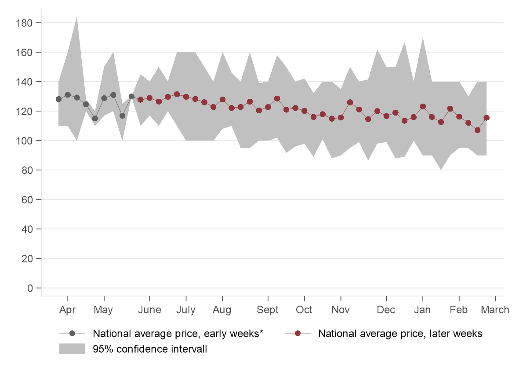
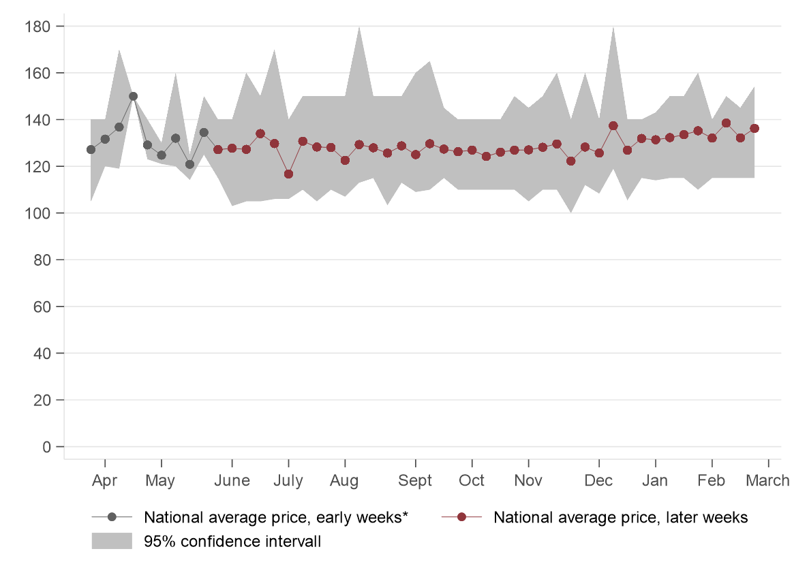
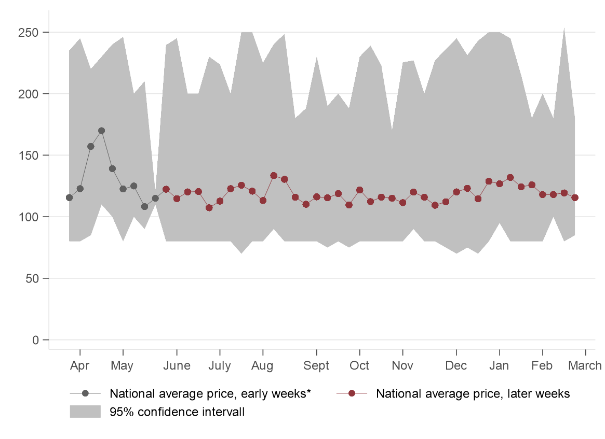
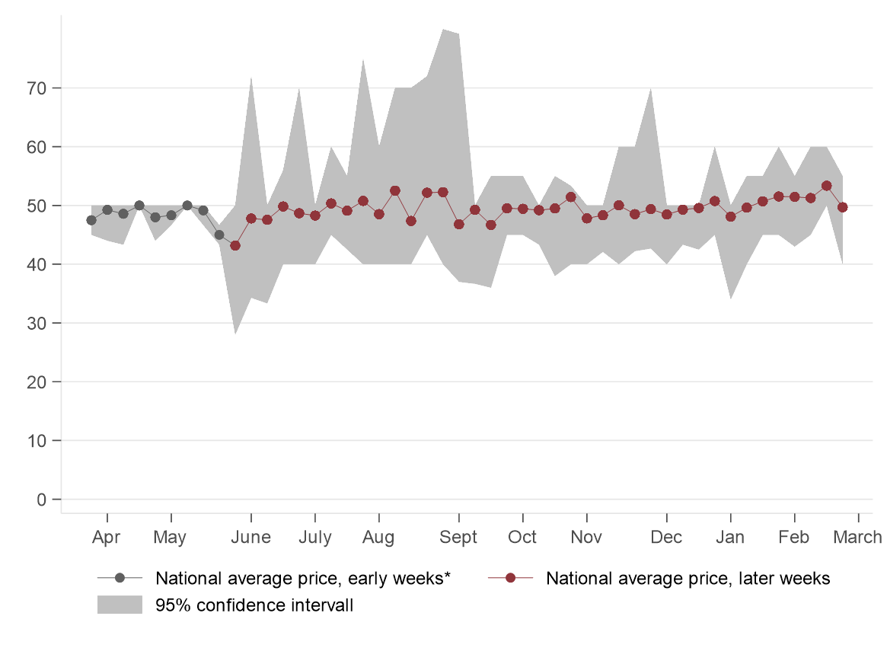
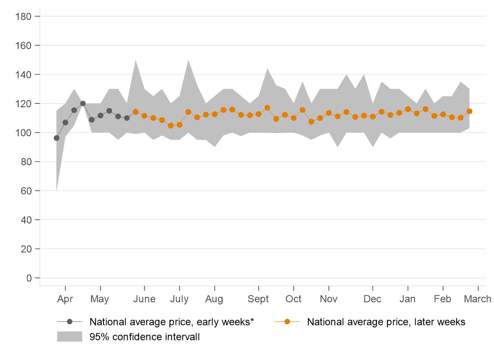
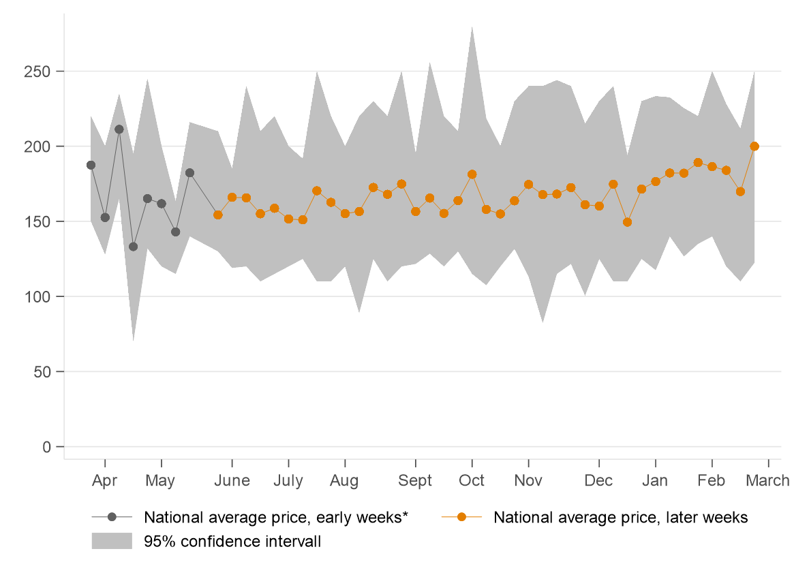
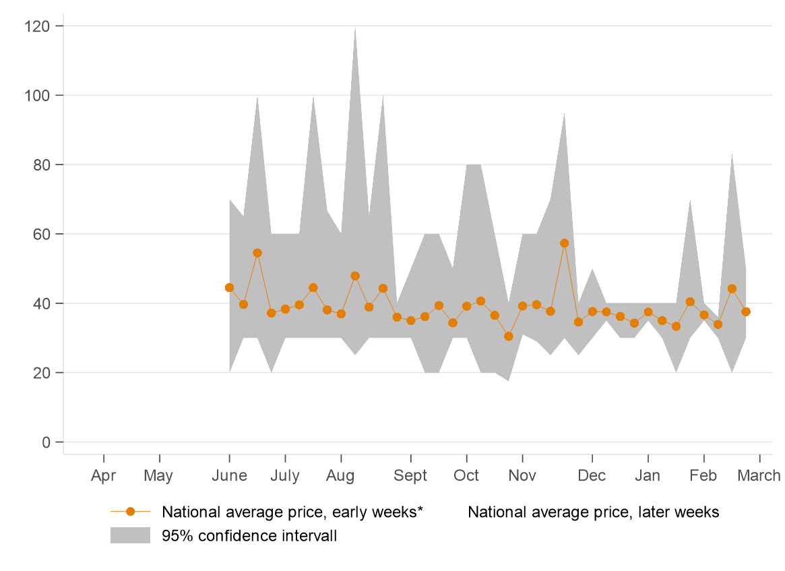
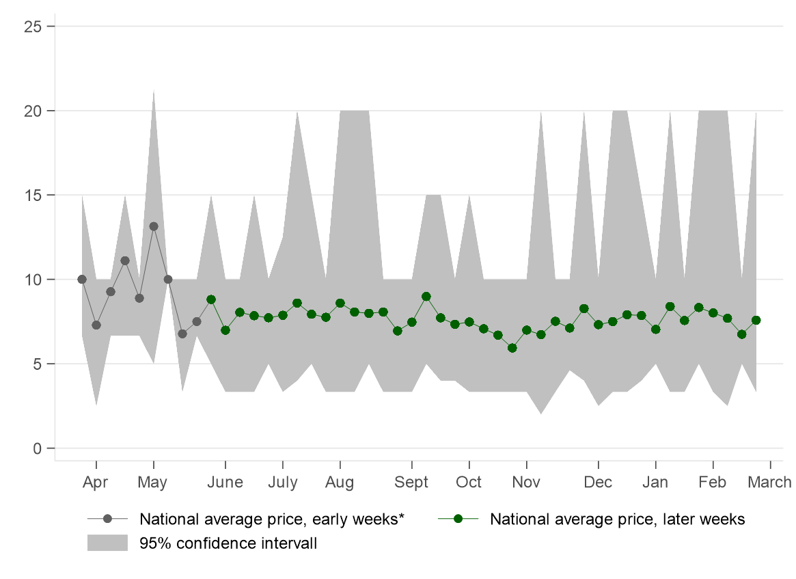

```{r setup, include=FALSE}
knitr::opts_chunk$set(echo = TRUE)
```
  
    
  


##  {.tabset}

### Bread and cereals 
<font size="5">**Maize flour (2 kg)**</font>
  
  

*** 

<font size="5">**Wheat flour (2 kg)**</font>
  
  

***   

<font size="5">**Rice (1 kg)**</font>
  
  
  
*** 

<font size="5">**White bread (400 g)**</font>
  
  

*** 

<font size="5">**Brown bread (400 g)**</font>
  
  

*** 

### Other items

<font size="5">**Sugar (1 kg)**</font>
  
  

***   

<font size="5">**Cooking oil (1 litre)**</font>
  
  

***


<font size="5">**Salt (1 kg)**</font>
  
  

***   

<font size="5">**Milk (500 ml)**</font>
  
  

***   

<font size="5">**Egg (one)**</font>
  
  


*** 

### Fruits


<font size="5">**Banana (one)**</font>
  
  
  
***
  
<font size="5">**Avocado (one)**</font>
  
  
  
***
  
<font size="5">**Mango (one)**</font>
  
  

*** 

## {}

We rely on a quick-response online survey to track product prices and availability of selected essential consumer products across Kenya. The data are collected with the help of volunteers, mainly university students and affiliates of NGOs, who record information through an online form on their smartphone - either when or after visiting a shop in-person or getting deliveries. Embedding the survey into day-to-day activities of respondents helps us to address concerns about initiating or prolonging human interactions that would not occur otherwise. The geographic distribution of the survey responses correlates strongly with population density and covers 42 out of 47 counties. Regions of the country with good mobile network coverage are over-represented in our sample. Counties in the North of Kenya are under-represented. About 30% of the respondents shop at supermarkets, close to 40% at general shops, 15% at kibandas, 7% at roadside stalls, 6% at open air markets and the remaining 2% on online platforms. 

So far we collected 5,855 survey responses since 27th March 2020.  On average respondents record prices of 4-5 items per survey. 

*The data is sparse in the early weeks of the data collection, which needs to be taken into account for the interpretation of the price dispersion in those week. With the support of numerous partners we were able to expand our network of volunteers over time.

| Week of the year	| Dates	| Number of online surveys |
|------|:-----:|:---------:|
|2020|
| Week 13 |	27 March  - 31 March 	| 25 |
| Week 14 |	1 April  - 7 April  	| 25 |
| Week 15 |	8 April  - 14 April 	| 23 |
| Week 16 |	15 April  - 21 April 	| 21 |
| Week 17 |	22 April  - 28 April 	| 16 |
| Week 18 |	29 April  - 5 May 	| 29 |
| Week 19 |	6 May  - 12 May 	| 36 |  
| Week 20 |	13 May  - 19 May 	| 21 |
| Week 21 |	20 May  - 26 May 	| 11 |
| Week 22 |	27 May  - 2 June 	| 92 |
| Week 23 |	3 June  - 9 June 	| 117 |
| Week 24 |	10 June  - 16 June 	| 159 |
| Week 25 |	17 June  - 23 June 	| 225 |
| Week 26 |	24 June  - 30 June 	| 191 |
| Week 27 |	1 July  - 7 July 	| 200 |
| Week 28 |	8 July  - 14 July 	| 198 |
| Week 29 |	15 July  - 21 July 	| 199 |
| Week 30 |	22 July  - 28 July 	| 198 |
| Week 31 |	29 July  - 4 August 	| 180 |
| Week 32 |	5 August  - 11 August 	| 198 |
| Week 33 |	12 August  - 18 August 	| 216 |
| Week 34 |	19 August  - 25 August 	| 194 |
| Week 35 |	26 August  - 1 September 	| 194 |
| Week 36 |	2 September - 8 September	| 193 |
| Week 37 |	9 September  - 15 September 	| 203 |
| Week 38 |	16 September  - 22 September 	| 187 |
| Week 39 |	23 September  - 29 September 	| 200 |
| Week 40 |	30 September  - 6 October 	| 212 |
| Week 41 |	7 October  - 13 October 	| 186 |
| Week 42 |	14 October  - 20 October 	| 194 |
| Week 43 |	21 October  - 27 October 	| 187 |
| Week 44 |	28 October  - 3 November 	| 163 |
| Week 45 |	4 November  - 10 November 	| 184 |
| Week 46 |	11 November  - 17 November 	| 168 |
| Week 47 |	18 November  - 24 November 	| 146 |
| Week 48 |	25 November  - 2 December 	| 190 |
| Week 49 |	3 December  - 8 December 	| 175 |
| Week 50 |	9 December  - 15 December 	| 154 |
| Week 51 |	16 December  - 22 December 	| 155 |
| Week 52 |	23 December  - 31 December 	| 194 |

Last updated on 2nd January 2021.

*** 
Acknowledgement:

We are immensely grateful for Mdoe Jackson (Kenyatta University)'s support in the early stages of the project. We are also grateful for the support of Mary Mang'eli (Kenyatta University and Laikipia University), Priscah Mukii David (Garissa University), David Kamau Karienye (Garissa University), Isack  Nyakach (Karatina University), and Urbanus Wambua (Karatina University) in helping us reach out to a fantastic group of student volunteers. We thank Innovations for Poverty Action (IPA) Kenya for their support in distributing the link for the online survey. 

The data collection is made possible thanks to the outstanding contributions from over 150 volunteers. Special thanks to Faith Mutinda, Felix Ongori Mbaka, Brian Kwanya, Mayaka Jackson, Mary Maina, David Ochieng, Sang Stacey Jebet, Elizabeth Mwikali Wambua, Teresia Wangeci Thiong'o, Mwita Selvenus Gesabo, Lynette Wangeci, Frankline Nisah, Juliet Kemunto Marigwa, Lemiso Patrick Kayioni, Samuel Muiruri Thiongo, Kelvin Mutwiri, Elijah Mbila, Gideon Kipkirui Yegon, James Ngumo Kanji, Billy Osborn Atetwe, Bronson Mwiti, Achaya Everlyne, Maina Albert Chrispin, Justus Munywoki, Mdoe Samson, Brenda Farida Kemunto Mokua, Mark Lubanga, George Kwanzu, Domnick Oyoo, Victor Okello Sirama, James Odhiambo Ochieng, Janet Mukonyo Kioko, William Musya Kitheka, Cheruiyot Langat, Janet Kipchilis, Brian Mutua, Timothy Kemboi Kipruto, Inviolata Lusweti, Phabian Odhiambo, Sayydd Were, Baserecha Lavender, Antony Ngumbi, Andrea Mwalaga, Hillary Baraka Muuga, Phylis Wangoto, Elizabeth Akinyi Odhiambo Ondego, Tilen Ododa, Desmond Juma, Titi Kibitok Enock, Cosmas Owuor, Alphonce Ochieng, Olivier Masengesho, Gabriel Keith Odunga, Moses Kimani Njoroge, Veronicah Ndungu, William Onura Akwanyi, Denis Kipkoech Ngetich, Precious Kirigo, Grace Wangari Ndungu, Fostina Mirenja, Robert Wafula Odhiambo, Langat Kibet Gideon, Violet Kabuga, Antony Ngumbi, and Augastine Esrom.

We gratefully acknowledge funding from the Centre for the Study of African Economies (CSAE) at the University of Oxford and the International Growth Centre (IGC).

The survey is run by George Kinyanjui (University of Cape Town) and Verena Wiedemann (University of Oxford).

We have collected similar data for Uganda since June 2020. Please contact us for more information and the latest version of our price bulletin for Uganda. 
  